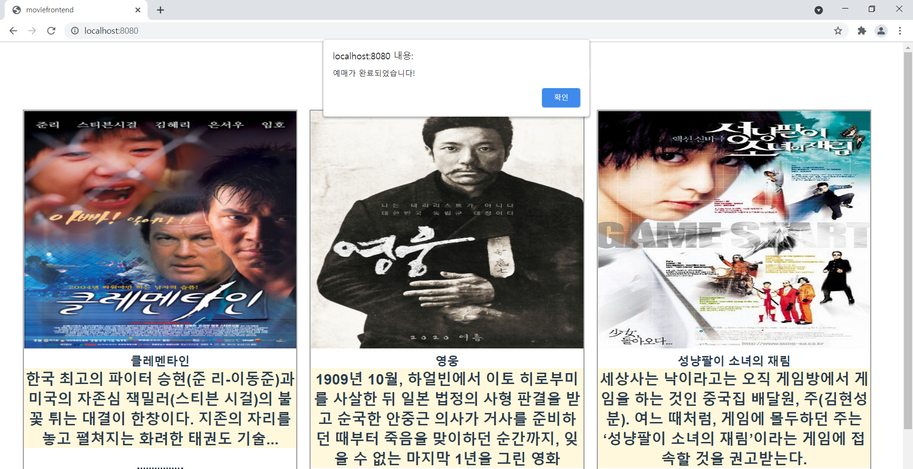

# 2차 기술교육 과제 : 영화 예매 프로그램
## 기술스택 
> Vue.js + HTML + JavaScript + Spring + Java + Mysql

## 화면캡쳐
### 동영상 시연

### 화면1 : 상영작, 상영작에 대한 설명 표시

### 화면2 : 선택한 영화에 대한 상영관, 상영시간, 제목, 전체좌석 및 남은좌석 표시

### 화면3 : 선택한 시간대에 따른 좌석 표시, 맨 위에 관람인원 선택 후 좌석 선택 가능

### 화면4 : 예매내역 확인 및 핸드폰 번호로 예매 완료

### 화면5 : 예매완료 알람과 동시에 메인 화면으로 돌아감

### 화면6 : 핸드폰 번호로 예약내역 조회

### 화면7 : 예약내역 확인

